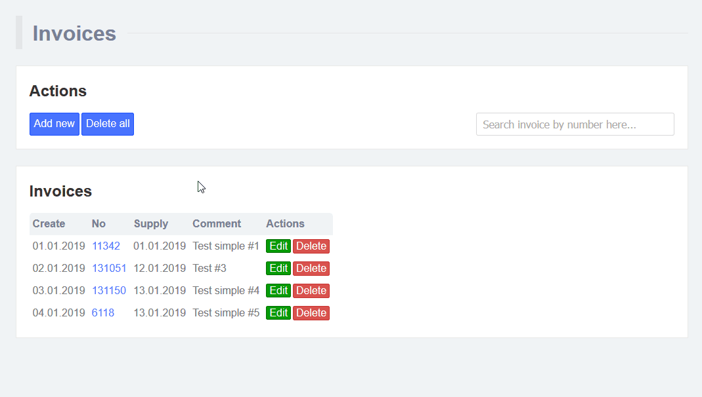

# IFINUM (Episode #4)

**Ifinum** - мое первое React-приложение. В приложении реализованы CRUD-операции c данными.

## О проекте
Этот проект посвящен выполнению тестового задания на позицию Junior Front-end developer. Подробнее о задании можно узнать по [ссылке](https://github.com/devjsru/react_test/blob/master/ifinum/task.md).
Проект является учебным и предназначен для изучения библиотеки [React](https://github.com/facebook/react) и связанной с ней экосистемой, получения практических навыков.

## Что используется
* React
* [Redux](https://github.com/reduxjs/react-redux)
* [create-react-app](https://github.com/facebook/create-react-app)
* [React Router (react-router-dom)](https://github.com/ReactTraining/react-router)
* [uniqid](https://github.com/adamhalasz/uniqid), [uuid](https://github.com/kelektiv/node-uuid) (модули генерации идентификаторов)
* CSS Modules

У Вас должен быть установлен [Node.js](https://nodejs.org/en/).

## Список дел
- [x] CRUD
- [x] Redux
- [ ] Устранить разночтения между требованиями задания и текущей реализацией (форматы дат, rest api сервер и т.п.)
- [ ] Удаление из списка нескольких выбранных записей
- [ ] Постраничный вывод записей из списка (пагинация)
- [ ] Рефакторинг
- [ ] Адаптивная валидная верстка
- [ ] Покрытие кода тестами

## Демо



## Как установить

Скопируйте проект с github
```bash
git clone https://github.com/championo/ifinum.git
```
Перейдите в папку с проектом
```bash
cd ifinum
```
Восстановите Node.js модули
```bash
npm install
```

**Примечание: Вы также можете [**скачать**](https://github.com/championo/ifinum/archive/master.zip) проект как zip-архив** (после скачивания и распаковки необходимо выполнить команду `npm install`).

## Как запустить

Запустите Node.js сервер
```
npm start
```

В браузере по умолчанию автоматически откроется вкладка с адресом [http://localhost:3000/](http://localhost:3000/).

## Модель данных

| Поле          | Формат данных |  Описание                             |
|---------------|---------------|---------------------------------------|
| id            | Hex Guid      | Уникальный идентификатор              |
| direction     | Guid          | Идентификатор направления поставки?   |
| number        | Число         | Номер счета                           |
| date_created  | Дата          | Дата создания записи                  |
| date_due      | Дата          | Дата счета?                           |
| date_supply   | Дата          | Дата поставки                         |
| comment       | Строка        | Комментарий                           |

**Примечание**
* id - строка в формате Hex Guid, полученная как префикс `5ac1f09a` + последовательность 16-ти сгенерированных символов. Мне неизвестен способ, которым автор задания получает такой id, но в своей работе я генерирую его с помощью [uniqid](http://localhost:3000/). Вместо 16-ти дополнительных символов создаются 8.
* direction - строка в формате guid xxxxxxxx-xxxx-4xxx-yxxx-xxxxxxxxxxxx, которая генерируется с помощью модуля [uuid/v4](http://localhost:3000/)
* date_* - строка, содержащая дату в длинном формате

Оригинальные данные выглядят так:
```javascript
{
  "id": "5ac1f09a60edb54701c767da",
  "direction": "8ad47368-b85b-4b25-a209-9a975fa85ba1",
  "number": 55958,
  "date_created": "07 May 1973",
  "date_due": "15 August 2009",
  "date_supply": "28 May 2004",
  "comment": "Officia cillum fugiat aliqua dolor sint adipisicing..."
}
```

## Компоненты

В приложении есть компоненты с состоянием (statefull), так и без него (stateless). 
Компонентов без состояния большинство. Они служат для отображения (вывода) информации. К там компонентам можно отнести: Header, ListErrors, Notify, Section, InvoiceInfo и другие. 
К компонентам с состоянием (изменяют состояние/данные) можно отнести:  Create, Edit и другие.

## Назначение компонент
* About - отображает информацию о проекте
* Actions - содержит контролы для управления списком счетов (создать, очистить, фильтровать)
* Create - отвечает за создание новой сущности
* ConfirmDeleteDialog - диалог подтверждения удаления всех счетов
* DeleteAll - страница подтверждения удаления всех элементов
* Details - отображает в зависимости от корректного id либо страницу с информацией о счете или страницу NotFound
* Edit - отвечает за изменение сущности
* EditableForm - единая форма ввода данных для компонент Create и Save. В ней только поля ввода данных
* Header - отображает заголовок страницы
* Invoices - это главная (домашняя) страница
* ListErrors - отображает список ошибок
* Notify - popup панель уведомлений о тех или иных событиях (ошибка удаления, успех создания новой сущности и т.д.)
* Search - компонент фильтрации данных
* Section - контейнер для визуального объединения UI-элементов в группу. По сути просто заменяет <div className="BorderedContainer"></div>

## Redux

Папка redux - содержит действия, редуктор по работе с хранилищем. Структура, названия каталогов и файлов - типовые для проектов, использующих redux.

## Обратная связь
Буду рад слышать от вас замечания и рекомендации по проекту. Для связи со мной используйте telegram [https://t.me/championo](https://t.me/championo)